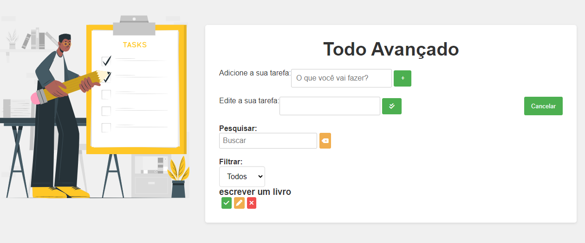

# To Do List
Este projeto é um aplicativo web para gerenciamento de tarefas avançado, escrito em HTML, CSS e JavaScript. Ele permite que você adicione, marque como concluídas, edite e filtre suas tarefas. 
O projeto foi feito baseado nas vídeos aulas do [Mathes Battisti](https://github.com/matheusbattisti), o mesmo publicou as aulas em seu canal do YouTube, chamado [Hora de Codar](https://youtu.be/HSssE1PRQcA?si=SoCg-EmshS2W6lVB)

## Índice
* [Descrição](#descrição)
* [Introdução](#introdução)
* [Funcionalidades](#funcionalidades)
* [Técnicas e tecnologias utilizadas](#técnicas-e-tecnologias-utilizadas)
* [Fontes Consultadas](#fontes-consultadas)

## Descrição
Este projeto consiste em um aplicativo web para gerenciamento de tarefas, construído com HTML, CSS e JavaScript. O objetivo principal é oferecer uma ferramenta completa e intuitiva para organização de tarefas diárias, permitindo ao usuário adicionar, editar, marcar como concluídas, filtrar e remover tarefas de forma eficiente.

## Introdução
Este aplicativo web de gerenciamento de tarefas oferece uma solução completa e versátil para organização pessoal e profissional. As funcionalidades abrangentes, a interface intuitiva e a utilização de tecnologias modernas garantem uma experiência de usuário positiva e eficiente.
- **Front-end:**
    * HTML: Estrutura da página web e elementos da interface do usuário.
    * CSS: Estilização visual da interface, incluindo cores, fontes e layout.
    * JavaScript: Lógica do aplicativo, interação com o usuário e manipulação do DOM.
    * Font Awesome: Ícones utilizados nos botões para melhor usabilidade.
- **Armazenamento Local:**
    * O armazenamento local do navegador é utilizado para persistir as tarefas criadas pelo usuário, mesmo após a atualização da página. Isso garante que as tarefas permaneçam salvas mesmo que o usuário feche o navegador ou acesse o aplicativo de um dispositivo diferente.

## Funcionalidades
- **Criação de Tarefas:**
    * O usuário pode adicionar novas tarefas digitando-as no campo de entrada de texto e clicando no botão "Adicionar".
    * Cada tarefa é representada por um item individual na lista de tarefas.

- **Edição de Tarefas:**
    * É possível editar o texto de uma tarefa existente clicando no botão "Editar".
    * As alterações são salvas automaticamente após o usuário confirmar a edição.

- **Marcação de Tarefas como Concluídas:**
    * Ao clicar no botão "Concluído", a tarefa é marcada como concluída e riscada na lista.
    * Tarefas concluídas podem ser desmarcadas clicando novamente no botão "Concluído".

- **Remoção de Tarefas:**
    * A exclusão de uma tarefa é realizada clicando no botão "Remover".
    * A confirmação da remoção é necessária para evitar ações acidentais.

- **Pesquisa de Tarefas:**
    * O campo de pesquisa permite filtrar as tarefas exibidas na lista.
    * Digitar um termo de pesquisa mostrará apenas as tarefas que contêm esse termo.

- **Limpeza da Pesquisa:**
    * O botão "Limpar" ao lado da caixa de pesquisa remove o termo de pesquisa e exibe todas as tarefas novamente.

- **Filtro de Tarefas:**
    * O menu suspenso "Filtrar" permite categorizar as tarefas exibidas.

- **As opções de filtro incluem:**
    * Todos: Exibe todas as tarefas.
    * Feitos: Exibe apenas tarefas concluídas.
    * A Fazer: Exibe apenas tarefas não concluídas.

## Técnicas e tecnologias utilizadas
* [<code></code>](https://developer.mozilla.org/pt-BR/docs/Web/HTML)
* [<code></code>](https://developer.mozilla.org/pt-BR/docs/Web/CSS)
* [<code></code>](https://developer.mozilla.org/pt-BR/docs/Web/JavaScript)
* [<code></code>](https://git-scm.com/)
* [<code></code>](https://bard.google.com/chat?hl=pt)
* [<code></code>](https://code.visualstudio.com/)
* [<code></code>](https://github.com/)
* [<code></code>](https://m.youtube.com/?hl=pt-pt)

## Fontes consultadas 
* [Alura - Como escrever um bom README.md](https://www.alura.com.br/artigos/escrever-bom-readme)
* [Bootstrap](https://getbootstrap.com/docs/5.3/forms/checks-radios/#radios)
* [Alura - Tipos de type](https://cursos.alura.com.br/forum/topico-type-do-campo-telefone-104370)
* [Dio](https://www.dio.me/articles/tutorial-criando-um-readme-bonitao-para-o-seu-github)
* [Progamador alternativo - Youtube](https://youtu.be/HJ16WEmOWTw?si=UFvCAtBHbuCc08Hu)
* [Fotos para o subtópico "Técnicas e tecnologias consultadas"](https://github.com/alexandresanlim/Badges4-README.md-Profile)
* [Youtube - TELA DE LOGIN COM TEMA DARK | HTML + CSS](https://youtu.be/69-WfrVBli8?si=GGultNVszQg0wDUK)
* [HomeHost](https://www.homehost.com.br/blog/tutoriais/html-buttton/)
* [W3schools](https://www.w3schools.com/js/js_window_location.asp)

## Autor(a)
|  [ Ana Santos](https://github.com/AnaLu1za) |  
| :---: |

[<code></code>](https://www.linkedin.com/posts/ana-luiza-santos-a5032a2a2_projeto-acad%C3%AAmico-valida%C3%A7%C3%A3o-de-tela-de-activity-7189273725291163648-fbh6?utm_source=share&utm_medium=member_ios)
